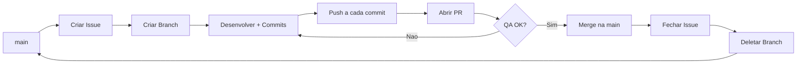

# Padrao de Fluxo de Trabalho (Git Workflow)

> **Objetivo:** Padronizar o fluxo de trabalho com Git para garantir rastreabilidade, qualidade e colaboracao eficiente. Este documento e obrigatorio para qualquer colaborador (humano ou IA).

---

## Indice

1. [Estrutura de Branches](#1-estrutura-de-branches)
2. [Ciclo de Vida da Branch](#2-ciclo-de-vida-da-branch-workflow)
3. [Padrao de Commits](#3-padrao-de-commits)
4. [Formatacao de Mensagens](#4-formatacao-de-mensagens-git-e-github)
5. [Padrao de Comentarios no Codigo](#5-padrao-de-comentarios-no-codigo)
6. [Gestao de Planos e Tarefas](#6-gestao-de-planos-e-tarefas-projeto)
7. [Tratamento de Conflitos](#7-tratamento-de-conflitos)
8. [Rollback e Revert](#8-rollback-e-revert)
9. [Configuracoes do Repositorio](#9-configuracoes-do-repositorio)

---

## Diagrama do Fluxo



---

## 1. Estrutura de Branches

**Regra:** Nunca trabalhe diretamente na `main`. Sempre crie uma branch especifica.

| Prefixo | Uso | Exemplo |
|---------|-----|---------|
| `feature/` | Novas funcionalidades | `feature/pagina-home` |
| `fix/` | Correcao de bugs | `fix/erro-consulta` |
| `hotfix/` | Correcoes urgentes em producao | `hotfix/webhook-zoom` |
| `refactor/` | Reestruturacao sem mudar comportamento | `refactor/consulta-participantes` |
| `chore/` | Manutencao e configuracao | `chore/ajuste-ci` |
| `docs/` | Documentacao | `docs/projeto` |

---

## 2. Ciclo de Vida da Branch (Workflow)

Siga este fluxo ao iniciar qualquer tarefa:

### 2.1 Antes de Codar

1. **Verificar duplicidade:** Buscar issues abertas e fechadas antes de criar nova. Se existir, comentar e reutilizar.
2. **Abrir Issue no GitHub:**
   - Criar a issue descrevendo o escopo antes de iniciar
   - **Assignee:** Atribuir para `@cirinho`
   - **Labels:** Adicionar labels apropriadas (`bug`, `enhancement`, `documentation`, etc.)
   - Exemplo via CLI:
     ```bash
     gh issue create --title "Titulo da Issue" --body "Descricao" --assignee cirinho --label "enhancement"
     ```
3. **Sincronizar local:**
   ```bash
   git checkout main
   git pull origin main
   ```
4. **Criar branch:**
   ```bash
   git checkout -b <prefixo>/<nome-descritivo>
   git push -u origin <prefixo>/<nome-descritivo>
   ```
5. **Vincular branch a issue:**
   ```bash
   gh issue develop <numero-da-issue> --checkout
   ```

### 2.2 Durante o Desenvolvimento

6. **Desenvolver:** Realizar as alteracoes nos arquivos.
7. **Commitar:** Seguir o [Padrao de Commits](#3-padrao-de-commits), sempre referenciando a issue.
8. **Push imediato:** Apos **cada commit**, fazer push:
   ```bash
   git push
   ```
   > **Regra de sincronizacao:** Nunca deixar commits pendentes localmente. O remoto deve estar sempre atualizado.

### 2.3 Finalizacao

9. **Preparar para PR (Rebase/Update):** Antes de abrir o PR, garanta que sua branch esta atualizada com a `main`:
   ```bash
   git fetch origin
   git rebase origin/main
   git push --force-with-lease
   ```
10. **Abrir Pull Request (PR):**
    - **Assignee:** Atribuir para `@cirinho`
    - **Labels:** Usar as mesmas labels da issue
    - **Development:** Vincular a issue relacionada (para fechamento automatico)
    - **Corpo do PR deve conter:**
      - `Closes #X` ou `Fixes #X`
      - Referencia ao roadmap: `Ref: projeto/03-xx-...`
    - Exemplo via CLI:
      ```bash
      gh pr create --title "Titulo do PR" --body "Closes #X\n\nRef: projeto/03-01-home.md" --assignee cirinho --label "enhancement"
      ```
11. **QA antes do merge:** Validar funcionamento e responsividade; registrar o resultado no PR.
12. **Merge:** Apos aprovacao, fazer merge na `main`.
13. **Limpeza (local e remoto):**
    ```bash
    git checkout main
    git pull origin main
    git branch -d <nome-da-branch>
    git push origin --delete <nome-da-branch>
    ```

---

## 3. Padrao de Commits

**Idioma:** Todos os commits em Portugues do Brasil (PT-BR).

**Codificacao:** Todos os arquivos devem ser salvos em **UTF-8**.

**Codificacao de Terminal (CLI):** Ao usar comandos com texto, garanta UTF-8 no terminal.
- **PowerShell (Obrigatorio):**
  ```powershell
  $OutputEncoding = [System.Text.Encoding]::UTF8
  ```

### Estrutura Obrigatoria

```
<tipo>(<escopo>): <resumo imperativo em ate 50 caracteres>
<LINHA EM BRANCO OBRIGATORIA>
- Detalhe especifico do que foi alterado
- Outro detalhe tecnico relevante
- Refs #<numero-da-issue>
- Ref: projeto/03-xx-... (roadmap)
```

> **Atencao:** A linha em branco entre o titulo e o corpo e obrigatoria. Sempre referenciar a issue e o roadmap correspondente.

### Tipos de Commit

| Tipo | Uso |
|------|-----|
| `feat:` | Nova funcionalidade |
| `fix:` | Correcao de bug |
| `hotfix:` | Correcao urgente em producao |
| `refactor:` | Reestruturacao sem mudar comportamento |
| `chore:` | Manutencao, configuracao, dependencias |
| `docs:` | Alteracoes em documentacao |

### Exemplos

**Exemplo 1 - Docs:**
```
docs(projeto): atualiza roadmap da home

- Ajusta escopo e tarefas da pagina inicial
- Atualiza criterios de aceitacao
- Refs #3
- Ref: projeto/03-01-home.md
```

**Exemplo 2 - Fix:**
```
fix(participantes): corrige filtro por horario

- Ajusta validacao de data e hora
- Corrige intervalo de consulta
- Fixes #7
- Ref: projeto/03-02-pagina-adm.md
```

### Fechamento de Issue

No ultimo commit antes do PR ou no corpo do PR, usar:
- `Closes #123` - Para features
- `Fixes #123` - Para bugs
- `Resolves #123` - Alternativa generica

---

## 4. Formatacao de Mensagens (Git e GitHub)

1. **Commits:** Escrever mensagens multi-linha reais, sem `\n` literal.
2. **Issues/PRs:** Preferir arquivos de corpo para textos longos:
   ```bash
   gh issue create --body-file corpo-issue.md
   gh pr create --body-file corpo-pr.md
   ```
3. **Revisao visual:** Conferir a renderizacao no GitHub antes de finalizar.

---

## 5. Padrao de Comentarios no Codigo

**Idioma:** Todos os comentarios em Portugues do Brasil (PT-BR).

### Regras

1. **Inicio de funcao/bloco:** Comentario explicando objetivo e comportamento esperado.
2. **Trechos relevantes:** Comentarios resumindo logica e efeitos colaterais.
3. **Evitar obvios:** Nao comentar codigo autoexplicativo.

---

## 6. Gestao de Planos e Tarefas (projeto/)

Este repositorio usa a pasta `projeto/` como base de planejamento e roadmap.

### Estrutura
- `projeto/00-regras.md` (este documento)
- `projeto/01-tech-stack.md` (tecnologias)
- `projeto/02-arquitetura.md` (banco de dados)
- `projeto/03-00-base-layout` (fundacao visual)
- `projeto/03-01-home.md` (pagina inicial)
- `projeto/03-02-pagina-adm.md` (admin/participantes)
- `projeto/04-backlog.md` (backlog global)

### Regras
1. **Antes de codar:** Verificar se o roadmap ja cobre a tarefa. Se nao cobrir, criar novo arquivo `projeto/03-xx-...`.
2. **Marcar progresso:** Atualizar checkboxes conforme a entrega.
3. **Atualizar "Implementado":** Preencher com resumo do que foi entregue.
4. **Referenciar o roadmap:** Commits e PRs devem citar o arquivo do plano.

### Definition of Done (DoD)

Tarefa concluida quando:
- [ ] Todas as tarefas marcadas com `[x]`
- [ ] Secao **Implementado** preenchida
- [ ] PR aberto referenciando issue e roadmap
- [ ] QA realizado (funcional + visual)

---

## 7. Tratamento de Conflitos

1. Atualizar `main`:
   ```bash
   git checkout main
   git pull origin main
   ```
2. Fazer rebase da sua branch:
   ```bash
   git checkout <sua-branch>
   git rebase main
   ```
3. Resolver conflitos e continuar:
   ```bash
   git add <arquivo-resolvido>
   git rebase --continue
   ```
4. Enviar para o remoto:
   ```bash
   git push --force-with-lease
   ```

---

## 8. Rollback e Revert

### Reverter o ultimo merge
```bash
git checkout main
git pull origin main
git revert -m 1 <hash-do-merge>
git push
```

### Reverter um commit especifico
```bash
git revert <hash-do-commit>
git push
```

---

## 9. Configuracoes do Repositorio

Configuracoes recomendadas no GitHub para proteger a `main`:

- [x] Require pull request before merging
- [x] Require approvals (minimo 1)
- [x] Dismiss stale pull request approvals when new commits are pushed
- [x] Require status checks to pass before merging (quando houver CI)
- [x] Do not allow bypassing the above settings

---

## Historico de Alteracoes

| Data | Descricao |
|------|-----------|
| 2026-01-02 | Documento inicial com regras adaptadas ao repositorio |